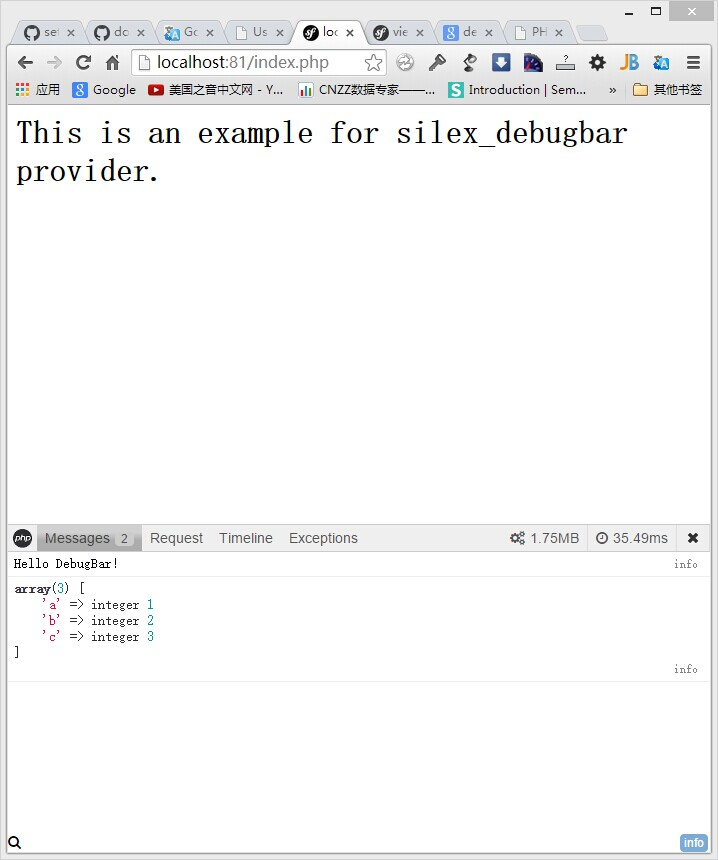

php-debugbar provider for silex.

##Install

`composer require dongww/silex-debugbar *`

##Usage

~~~ .php
$app->register(new Dongww\Silex\Provider\DebugBarServiceProvider());
~~~

The JS and CSS files will be loaded from vendor directory automatically.

If vendor directory or debugBar's Resources directory already exists in the web public directory,
you can set option 'debug_bar.auto_res' to `false`, and set option 'debug_bar.path' to resources directory.
This will speed up the loading speed.

~~~ .php
$app->register(new Dongww\Silex\Provider\DebugBarServiceProvider(), [
    'debug_bar.auto_res' => false, //Optional, default is true
    'debug_bar.path' => '/debugbar', //Optional, default is null.
]);
~~~

##Example

~~~ .php
<?php
use Silex\Application;
use Dongww\Silex\Provider\DebugBarServiceProvider;

require_once __DIR__ . '/../vendor/autoload.php';

$app          = new Application();
$app['debug'] = true;

if ($app['debug']) {
    $app->register(new DebugBarServiceProvider(), [
//        'debug_bar.auto_res' => false, //Optional, default is true
//        'debug_bar.path'      => '/debugbar', //Optional, default is null.
    ]);
}

$app->get('/', function (Application $app) {
    $app['debug_bar']['messages']->addMessage("Hello DebugBar!");
    $app['debug_bar']['messages']->addMessage([
        'a' => 1,
        'b' => 2,
        'c' => 3,
    ]);

    return '<body><h1>This is an example for silex_debugbar provider.</h1></body>';
});

$app->run();
~~~

##Doctrine DBAL logs

If you use Doctrine Provider, sql logs will be automatically captured and displayed in debugBar.